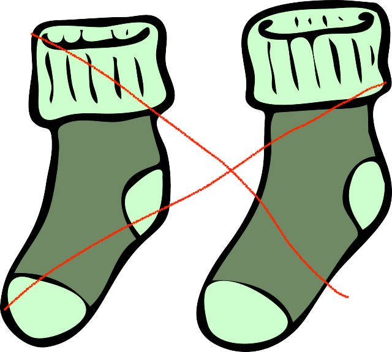

# nosocks
websockets_starters1

Запустите слитый сценарий, который использует ws, использующий Express для предварительной установки соединения по HTTP.

Протестируйте его работу.

Как видите, здесь в странице client.html захардкоден порт. Превратите client.html в client.pug и таким образом сделайте рендеринг, менее зависимый от хардкодинга. Здесь https://github.com/GossJS/express_starters0/tree/pug ветвь express, в которой акцент сделан на шаблонизаторе pug.

