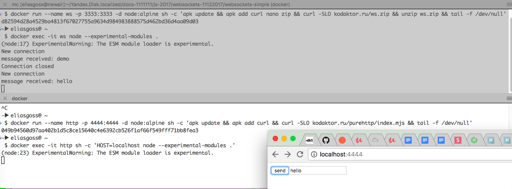
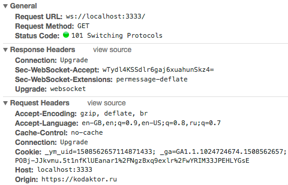

# шаг 1

Для моделирования ситуации раздельной работы вебсокетов и HTTP создадим два контейнера:
- `WS` docker run --name ws -p 3333:3333 -d node:alpine sh -c 'apk update && apk add curl nano zip && curl -SLO kodaktor.ru/ws.zip && unzip ws.zip && tail -f /dev/null'
- `HTTP` docker run --name http -p 4444:4444 -d node:alpine sh -c 'apk update && apk add curl && curl -SLO kodaktor.ru/purehttp/index.mjs  && tail -f /dev/null'

Они будут доступны:
- в устаревшем варианте как 192.168.99.100:3333 и 192.168.99.100:4444
- в более новом варианте как localhost:3333 и localhost:4444

Первый контейнер оперативно загрузит минималистичный сценарий для запуска WS-сервера.

```
docker exec -it ws node --experimental-modules .
```
Для его запуска.

Второй контейнер будет выполнять следующее:
- выдачу очень примитивной веб-страницы (формы) с WS-клиентом, которая подключается к 3333
- для этого запуск примитивного http-сервера, который работает на 4444.

Чтобы имитировать работу в чате, нужно будет подключаться к {IP}:4444.

```
docker exec -it http sh -c 'HOST=localhost node --experimental-modules .'
```

Если HOST не указать, клиент по умолчанию будет пытаться соединиться с 192.168.99.100

Удобно проводить эксперимент, открыв терминалы в двух панелях



и наблюдая за вкладкой Network



---

Могут быть полезны команды типа `lsof -i tcp:4444`, `netstat -vanp tcp | grep 4444` и др. для контроля работы приложений на портах; следует не забывать о гигиене и вовремя удалять контейнеры.

---

Так как это типичная ситуация нескольких контейнеров, логично развернуть её с помощью docker-compose - это упражнение.

---

Далее см. step1


