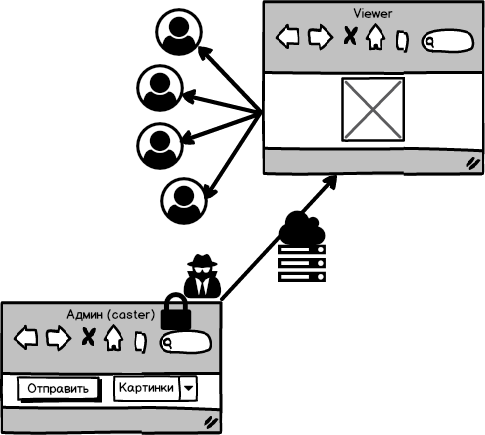

# nosocks
websockets_starters1

Выполните следующие задания

А. Слейте вместе сервера, обеспечивающие WS и HTTP. Пусть один сервер работает по одному порту с обоими протоколами.

Б. Слегка измените существующий код так, чтобы лог сообщений выводился не в консоль, а в окно, чтобы получился чат. Назовём его форчат. Так в упрощённом виде выглядит интерфейс: https://kodaktor.ru/wsclient

В. Разбейте архитектуру этого приложения на две части. Пусть одна страница (caster.html) будет защищена сессией. Её посетитель имеет право отправлять сообщения вида image001.png. При получении такого сообщения на странице viewer.html меняется картинка на указанную. Сценарий на странице viewer.html не позволяет отправлять сообщения вообще или такие, которые могут быть интерпретированы как запрос на смену картинки. На сервере, который занимается ретранслированием вещания кастера, находится несколько картинок. Так мы можем организовать примитивное вещание «слайдов» как на https://kodaktor.ru/slider

Г. Исследуйте дополнительные возможности работы с веб-сокетами, представленные библиотекой socket.io https://socket.io/  и создайте версию предыдущего решения на основе socket.io
