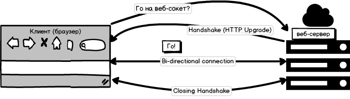

# nosocks
Сокет — это обобщённый термин, который обозначает коммуникационный интерфейс. Если два приложения должны общаться между собой, то они делают это через сокет(ы), т.е. можно сказать, что каждое приложение «видно» другому как сокет. Например, php-fpm может общаться с веб-сервером через Юникс-сокет.  Другая аналогия: сокет — это окно в регистратуре или общественной приёмной. В терминах интернета можно конкретизировать  TCP/IP сокет как пару «IP-адрес» — «номер порта», которая однозначно представляет приложение. У клиентских сценариев никогда не было прямого доступа к TCP/IP сокетам, но он был у плагинов типа Flash. 

Традиционное взаимодействие веб-клиента и веб-сервера на основе HTTP однонаправленно. Сначала в одном направлении идёт запрос, затем в противоположном направлении идёт ответ. Каждый ресурс в общем требует своего собственного обмена репликами. Это достаточно естественно, когда нужно получать с сервера сущности, которые не меняются в режиме реального времени. Сайт традиционно отражает некий снэпшот информации, т.е. состояние дел на некоторый данный момент. Если информация обновляется, на сайте размещают уведомление, увидев которое посетитель должен сам загрузить новую версию страницы или картинки. Более продвинутым вариантом являются push-уведомления, при котором сервер выполняет несколько более активную роль.

Но если процесс обновления происходит перманентно — т.е. идёт обсуждение или совместное редактирование документа, то информация должна отображаться синхронно у всех участников. Традиционная реализация HTTP совершенно не приспособлена для решения такой задачи, в отличие от протокола WebSockets (WS). Хотя HTTP/2 + Server-Sent Events приближаются к этому решению, реализации WS более распространены (декабрь 2017).

WS не является альтернативой для HTTP — он не умеет отдавать веб-страницы браузеру так, чтобы те в нём отображались. Поэтому говорят, что WS работает поверх HTTP.

Протокол состоит из рукопожатия и обмена сообщениями. 

---

Если принять за предусловие, что у нас уже есть загруженная страница 
 (или десктоп-окошко)
то  в принципе можно просто обмениваться данными по веб-сокетам без всякого HTTP

[Начало: веб-сокеты отдельно, http отдельно](https://github.com/GossJS/nosocks/tree/pure)

